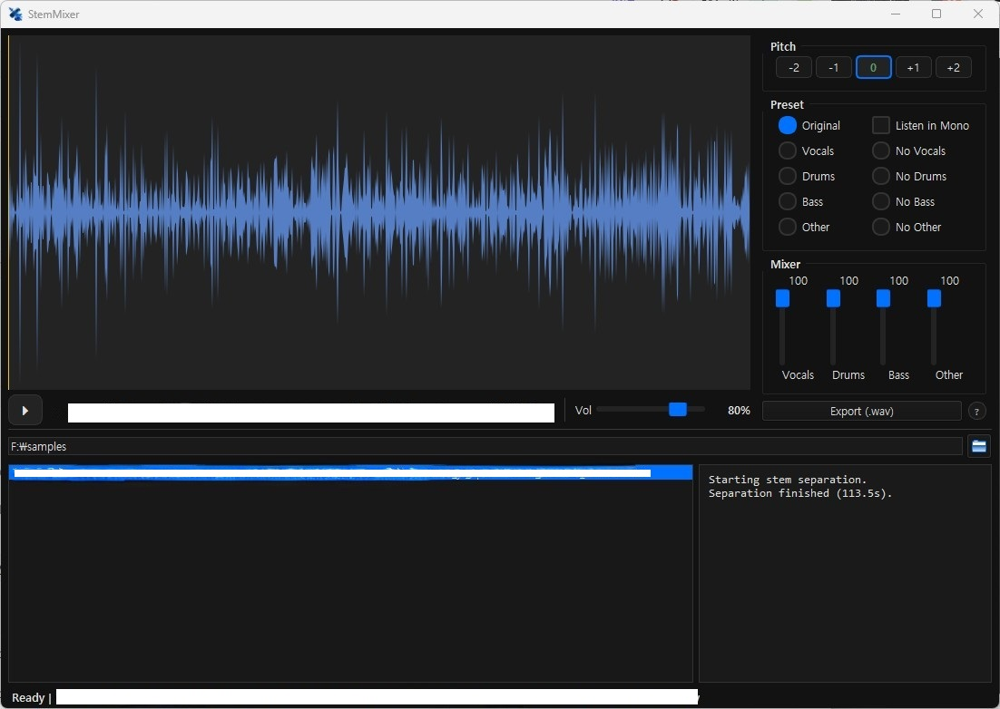

<h1> StemMixer</h1>

곡을 **보컬 · 드럼 · 베이스 · 기타(건반)** 네 가지 악기 스템으로 나눈 뒤, 피치·믹스·내보내기까지 한 번에 할 수 있는 Windows용 음원 편집 프로그램입니다.

## 다운로드 (Windows)

[**StemMixer v1.0.0 Installer (exe)**](https://github.com/acegikm7on/StemMixer-Release/releases/latest/download/StemMixer_v1.0.0_Installer.exe)

---

## 주요 기능

### AI 스템 분리

- 한 곡을 **보컬, 드럼, 베이스, 기타/건반** 스템으로 자동 분리합니다.
- 분리가 끝나면 각 스템을 바로 재생·조절할 수 있습니다.

### 피치 시프트 (키 변경)

- **±2 반음** 범위에서 키를 올리거나 내릴 수 있습니다.
- 보컬·베이스·기타 스템에 피치를 적용합니다. (드럼은 원음 유지)
- **보컬** 피치 변경 시 포먼트(목소리 특성)를 최대한 유지하도록 처리합니다.
- 한 번 만든 피치 결과는 저장되어, 같은 곡을 다시 열 때 빠르게 불러옵니다.

### 악기별 비율 조절 (믹서)

- 네 스템 각각의 **볼륨을 0~100%** 슬라이더로 세밀하게 조절합니다.
- 보컬만 크게, 드럼만 줄이기 등 원하는 밸런스로 실시간 미리듣기가 가능합니다.

### 프리셋

- **원본**, **보컬만**, **보컬 제거**, **드럼만**, **드럼 제거**, **베이스만**, **베이스 제거**, **기타/건반만**, **기타/건반 제거** 등 자주 쓰는 조합을 버튼 한 번으로 적용합니다.
- **모노로 듣기** 옵션으로 스테레오·모노 청취를 전환할 수 있습니다.

### 로컬/YouTube 음원 가공

- PC에 있는 **음원 폴더**를 지정하면, 그 안의 곡들을 순서대로 불러와 분리·편집할 수 있습니다.
- 경로 입력란에 **YouTube 주소**(단일 영상·재생목록)를 넣으면, 오디오를 가져와 동일한 분리·편집 파이프라인에 연결합니다.

### 내보내기

- 현재 키·믹서 설정이 반영된 결과를 **WAV**(기본) 또는 **MP3**(128 kbps)로 저장합니다.

---

## 문의

acegikm7on@gmail.com

---

# English

Split a track into **vocals · drums · bass · other (guitars/keys)** stems, then change pitch, mix levels, and export—all in one Windows app.

## Download (Windows)

[**StemMixer v1.0.0 Installer (exe)**](https://github.com/acegikm7on/StemMixer-Release/releases/latest/download/StemMixer_v1.0.0_Installer.exe)

## Features

### AI stem separation

- Automatically splits a song into **vocals, drums, bass, and other (guitars/keys)** stems.
- When separation finishes, you can play and adjust each stem right away.

### Pitch shift (key change)

- Raise or lower the key by up to **±2 semitones**.
- Pitch is applied to vocals, bass, and other stems. (Drums stay at the original pitch.)
- **Vocals** use formant preservation to keep voice character when shifting pitch.
- Pitch results are saved on disk so reopening the same song loads quickly.

### Per-instrument level control (mixer)

- Fine-tune each stem from **0–100%** with vertical sliders.
- Preview in real time—e.g. louder vocals, quieter drums—to get the balance you want.

### Presets

- One-click combos such as **Original**, **Vocals only**, **No vocals**, **Drums only**, **No drums**, **Bass only**, **No bass**, **Other only**, and **No other**.
- **Listen in mono** toggles between stereo and mono playback.

### Local / YouTube audio

- Point the app at a **folder of audio files** on your PC, or paste a **YouTube URL** (single video or playlist) in the path field.

### Export

- Save the current key and mixer settings as **WAV** (default, 32-bit float) or **MP3** (128 kbps CBR via bundled ffmpeg).
- In the save dialog, pick format from the file type dropdown.

## Contact

acegikm7on@gmail.com
