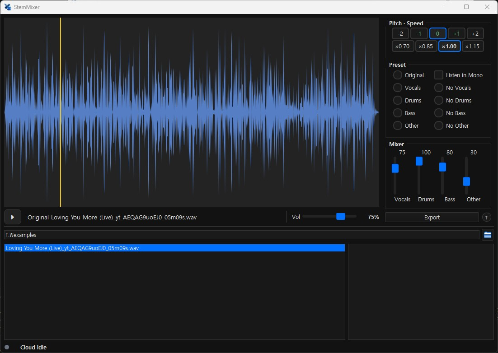

#  StemMixer


[](https://acegikm7on.github.io/StemMixer-Release/)

Windows용 AI 스템 분리 앱. 곡을 **보컬 · 드럼 · 베이스 · 기타/건반**으로 나누고, 키 변경·믹싱·WAV/MP3 저장까지 한 번에 처리합니다.



**랜딩 페이지:** [acegikm7on.github.io/StemMixer-Release](https://acegikm7on.github.io/StemMixer-Release/)

---

## 다운로드

| 앱 | 설치 파일 |
|---|---|
| **StemMixer** | [**v1.1.1 Installer (exe)**](https://github.com/acegikm7on/StemMixer-Release/releases/latest/download/StemMixer_v1.1.1_Installer.exe) |
| **VocalRemover** (보컬 제거) | [**v1.0.3 Installer (exe)**](https://github.com/acegikm7on/StemMixer-Release/releases/latest/download/VocalRemover_v1.0.3_Installer.exe) |

---

## 주요 기능

### StemMixer

| 기능 | 설명 |
|---|---|
| AI 스템 분리 | 보컬 · 드럼 · 베이스 · 기타/건반 자동 분리 |
| HQ Vocal | 고품질 보컬 분리 |
| 피치 시프트 | ±2 반음 키 변경 |
| 재생 속도 | 분리 결과 재생 속도 조절 |
| 악기별 믹서 · 프리셋 | 스템별 볼륨, 보컬/드럼 제거 등 원터치 조합 |
| YouTube | URL · 플레이리스트에서 곡 불러오기 |
| 보내기 | WAV 또는 MP3 저장 |

### VocalRemover

| 기능 | 설명 |
|---|---|
| 보컬 제거 | 보컬/반주 블렌드 조절 후 저장 |
| YouTube | URL · 플레이리스트 import |
| 간단 UI | 보컬 제거에 특화된 단순 화면 |

---

## 사용 방법


```text
OPEN → SPLIT → MIX → SAVE
```

1. 곡 파일 또는 YouTube URL을 엽니다.
2. AI 스템 분리를 실행합니다.
3. 피치와 악기별 볼륨을 조절합니다.
4. WAV 또는 MP3로 저장합니다.

---

## 문제 해결

| 상황 | 대처 |
|---|---|
| Windows 보호 화면 | `추가 정보` → `실행` |
| 분리가 오래 걸림 | 잠시 후 다시 시도 |
| 분리 실패 | 인터넷·방화벽 확인 후 재시도 |
| YouTube 로그인 요청 | 브라우저에서 로그인 후 재시도 |
| 앱 동작 이상 | 활동 패널 `Shift + 클릭`으로 로그 확인 |

---

## 최근 업데이트

**StemMixer v1.1.1** — 재생 안정화, 모노 믹스 수정, 분리·상태 표시 개선

**VocalRemover v1.0.3** — 분리 안정성·상태 표시 개선

[이전 버전 포함 전체 릴리스](https://github.com/acegikm7on/StemMixer-Release/releases)

---

## English

StemMixer separates a song into **vocals, drums, bass, and other instruments** on Windows. Change key, mix stems, and export WAV/MP3. **VocalRemover** is a companion app for vocal removal with a simpler UI.

**Download:** [StemMixer v1.1.1](https://github.com/acegikm7on/StemMixer-Release/releases/latest/download/StemMixer_v1.1.1_Installer.exe) · [VocalRemover v1.0.3](https://github.com/acegikm7on/StemMixer-Release/releases/latest/download/VocalRemover_v1.0.3_Installer.exe)

---

## 문의

* Developer: acegikm7on · [acegikm7on@gmail.com](mailto:acegikm7on@gmail.com)
