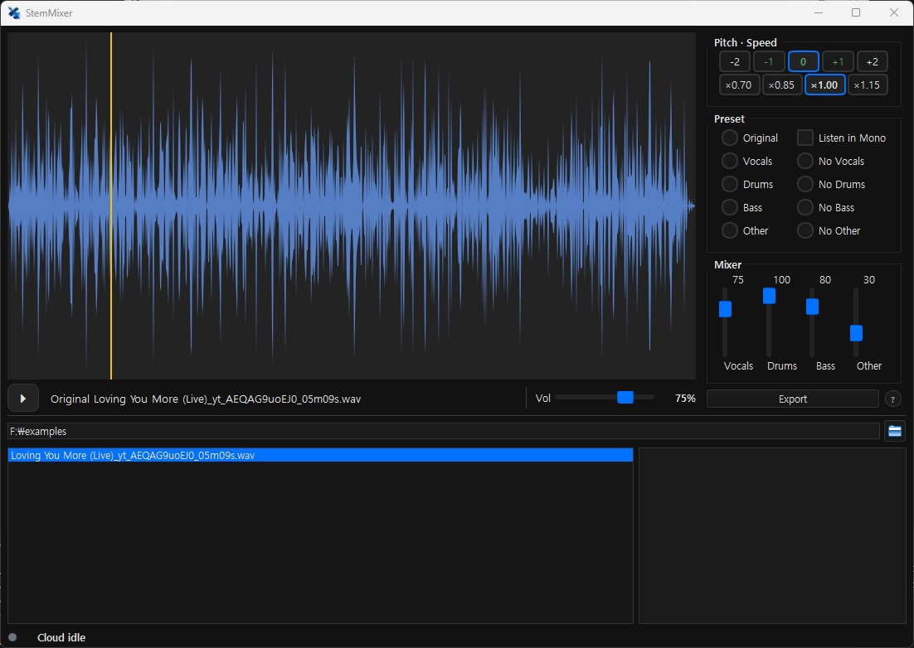
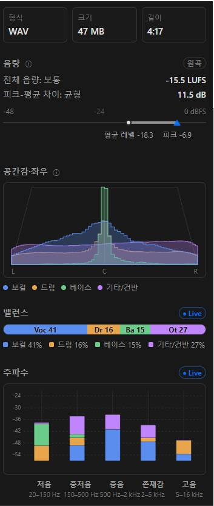

#  StemMixer


[](https://acegikm7on.github.io/StemMixer-Release/)
[](https://stemmixer.acegikm7on.workers.dev)

A simple Windows app for **AI music stem separation**.  
Separate a song into **vocals, drums, bass, and other instruments**, then change key, mix stems, and export WAV/MP3.

Windows용 AI 음원 분리 앱입니다.  
곡을 **보컬 · 드럼 · 베이스 · 기타/건반**으로 나누고, 키 변경·믹싱·WAV/MP3 저장까지 한 번에 처리합니다.



**Website / 웹사이트:** [acegikm7on.github.io/StemMixer-Release](https://acegikm7on.github.io/StemMixer-Release/)

---

## Download / 다운로드

<p>
  <a href="https://stemmixer.acegikm7on.workers.dev"></a>
  <a href="https://stemmixer.acegikm7on.workers.dev"></a>
</p>

**StemMixer Web** is the multi-platform way to open a song. It runs in the web browser, so the same link works on Windows, macOS, Linux, iPhone, and Android. No installer.

**StemMixer Web**은 여러 플랫폼에서 쓰는 브라우저 앱입니다. Windows, macOS, Linux, iPhone, Android 어디서나 같은 주소로 열고, 설치 없이 곡을 나누고 믹싱합니다. → [**Open / 열기**](https://stemmixer.acegikm7on.workers.dev)

| App | Use for / 용도 | Installer |
|---|---|---|
| **StemMixer Web**  | Multi-platform in any web browser — no install / 설치 없이 Windows·macOS·Linux·스마트폰 웹브라우저 | [**Open / 열기**](https://stemmixer.acegikm7on.workers.dev) |
| **StemMixer** | Stem separation, key change, mixing, export / 스템 분리·키·믹싱·내보내기 | [**Download v1.1.4**](https://github.com/acegikm7on/StemMixer-Release/releases/latest/download/StemMixer_v1.1.4_Installer.exe) |
| **VocalRemover** | Simple vocal removal / 간단한 보컬 제거 | [**Download v1.0.4**](https://github.com/acegikm7on/StemMixer-Release/releases/latest/download/VocalRemover_v1.0.4_Installer.exe) |

---

## Which app should I install? / 어떤 앱을 설치해야 하나요?

| Goal / 목적 | Recommended app |
|---|---|
| Separate vocals, drums, bass, and instruments / 여러 악기로 분리 | **StemMixer** |
| Change key, adjust stem volume, and export a custom mix / 키·볼륨 조절 후 저장 | **StemMixer** |
| Remove or reduce vocals with a simpler screen / 보컬만 빠르게 줄이기 | **VocalRemover** |
| Mix a song in any web browser, on any platform, without installing / 어떤 기기 웹브라우저에서나 설치 없이 믹싱 | **StemMixer Web**  |

---

## How to use / 사용 방법


```text
OPEN → SPLIT → MIX → SAVE
```

1. Open an audio file or YouTube URL.
2. Run AI stem separation.
3. Adjust key, speed, and stem volumes.
4. Export the result as WAV or MP3.

한국어:

1. 곡 파일 또는 YouTube URL을 엽니다.
2. AI 음원 분리를 실행합니다.
3. 키, 재생 속도, 악기별 볼륨을 조절합니다.
4. WAV 또는 MP3로 저장합니다.

---

## Main features / 주요 기능

### StemMixer

| Feature / 기능 | Description / 설명 |
|---|---|
| AI stem separation | Separate vocals, drums, bass, and other instruments |
| HQ Vocal | Higher-quality vocal separation |
| Pitch shift | Change key within ±2 semitones |
| Playback speed | Adjust playback speed after separation |
| Stem mixer & presets | Adjust each stem or use one-click presets |
| YouTube import | Load tracks from a URL or playlist |
| Export | Save as WAV or MP3 |

### VocalRemover

| Feature / 기능 | Description / 설명 |
|---|---|
| Vocal removal | Adjust vocal/instrumental balance and save |
| YouTube import | Import from URL or playlist |
| Simple UI | Focused screen for quick vocal removal |

### StemMixer Web 

Open it in a web browser on Windows, macOS, Linux, iPhone, or Android. Nothing to install — the same page is the app on every platform. The song-info panel describes the file you opened. Loudness and peak-to-average describe the original mix. Balance and frequency follow the faders.

Windows, macOS, Linux, iPhone, Android의 웹브라우저에서 바로 엽니다. 설치 프로그램 없이, 같은 주소가 모든 플랫폼의 앱입니다. 연 곡의 파일 정보를 보여 주고, 음량과 피크-평균 차이는 원곡 기준이며, 밸런스와 주파수는 현재 페이더를 따릅니다. → [**stemmixer.acegikm7on.workers.dev**](https://stemmixer.acegikm7on.workers.dev)

<p align="center">
  
</p>

| Item / 항목 | What it shows / 내용 |
|---|---|
| Format, size, duration / 형식 · 크기 · 길이 | The opened file |
| Loudness / 음량 | How loud the original mix is: a short label and the LUFS number. The scale places average level and peak in dBFS |
| Peak-to-average / 피크-평균 차이 | How far peaks sit above the average: a short contrast label and the dB number. This is contrast, not a quality score |
| Space / 공간감 | Where vocals, drums, bass, and other sit from left to right |
| Balance / 밸런스 | Each stem's share of the current mix |
| Frequency / 주파수 | Each stem's energy from low to high |

---

## Troubleshooting / 문제 해결

| Issue / 상황 | What to do / 대처 |
|---|---|
| Windows protection screen appears / Windows 보호 화면 | Click `More info` → `Run anyway` (`추가 정보` → `실행`) if downloaded from this official GitHub release |
| Separation takes a long time / 분리가 오래 걸림 | Wait and try again later / 잠시 후 다시 시도 |
| Separation fails / 분리 실패 | Check internet connection or firewall / 인터넷·방화벽 확인 |
| YouTube asks for login / YouTube 로그인 요청 | Log in with your browser and try again / 브라우저에서 로그인 후 재시도 |
| App behaves unexpectedly / 앱 동작 이상 | In StemMixer, `Shift + click` the activity panel to check logs / 활동 패널 `Shift + 클릭` |

---

## Latest update / 최근 업데이트

**StemMixer v1.1.4** — Smoother track/key/speed changes, more reliable cloud zip download  
**StemMixer v1.1.4** — 곡·키·배속 전환 시 UI 멈춤 완화, 클라우드 zip 다운로드 안정화

**VocalRemover v1.0.4** — YouTube CDN 403 handling, export error dialog  
**VocalRemover v1.0.4** — YouTube CDN 403 처리, 내보내기 오류 안내

[All releases / 전체 릴리스](https://github.com/acegikm7on/StemMixer-Release/releases)

---

## Contact / 문의

Developer: acegikm7on · [acegikm7on@gmail.com](mailto:acegikm7on@gmail.com)
